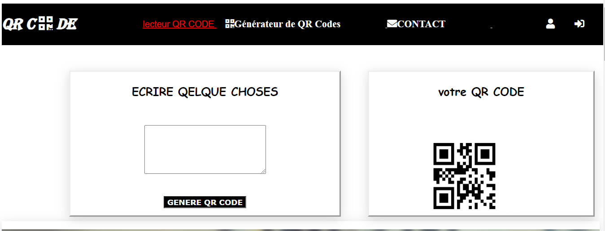

# QR Code Generator & URL Shortener

Ce projet propose une **plateforme web simple et intuitive** qui permet deux fonctionnalités principales :

- 🔗 **Le raccourcissement d'URLs** : transforme des liens longs en liens courts, plus faciles à partager.
- 📷 **La génération de QR codes** : transforme du texte ou une URL en QR code que l'on peut scanner avec un smartphone.

---

## 🧠 Objectif du projet

Ce projet a été réalisé dans le cadre d’un **stage d’initiation au développement web**. Il a pour but de mettre en pratique les compétences acquises en HTML, CSS, JavaScript, PHP et manipulation d’API, à travers un outil combinant deux services couramment utilisés.

---

## 🧾 À propos du projet

Ce dépôt GitHub contient tout le code source du générateur de QR code et de raccourcisseur d’URL. L’application repose sur des technologies web classiques et ne nécessite aucun framework, ce qui facilite sa lecture, sa modification et son déploiement pour les débutants comme pour les développeurs confirmés.

---

## 🚀 Fonctionnalités

- Raccourcissement d'URL (avec ou sans personnalisation du lien)
- Génération de QR code instantanée
- Copie rapide du lien raccourci
- Affichage visuel du QR code généré
- Design responsive (adapté à tous les écrans)
- Interface simple et accessible

---


## 🔗 API utilisée

Pour la génération de QR codes, le projet utilise l'API gratuite de [goqr.me](https://goqr.me/api/) :


Il suffit de passer l'URL ou le texte à encoder via le paramètre `data` pour obtenir une image QR code.

---

## 🛠️ Technologies utilisées

- **Langages & outils :**
  - HTML
  - CSS
  - JavaScript
  - PHP
  - MySQL

- **Librairies & services externes :**
  - API [goqr.me](https://goqr.me/api/) pour la génération de QR codes

- **Design :**
  - Responsive Web Design
  - Utilisation de préprocesseurs CSS : SCSS, LESS

---

## 📦 Installation & Exécution

1. Cloner le dépôt :

```bash
git clone https://github.com/wejdeen14/QR-code-shortner-URL.git
cd QR-code-shortner-URL
